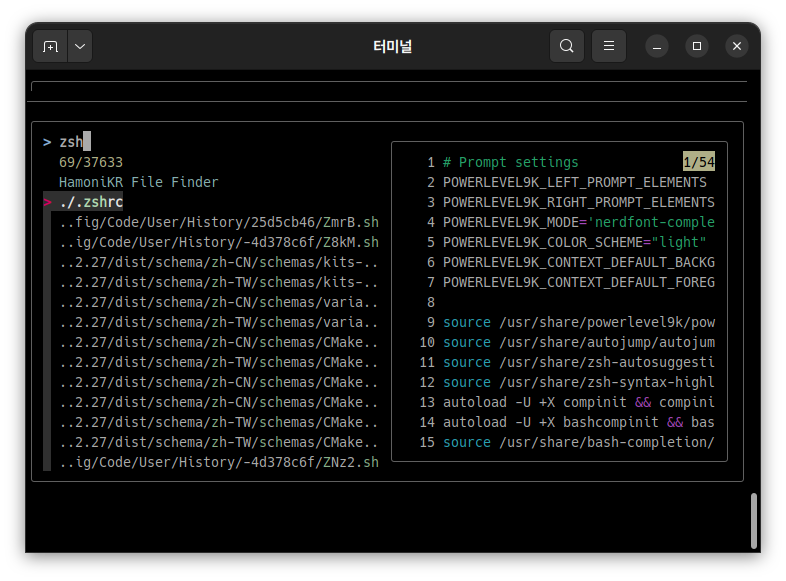

## hamonikr-ff

이 프로그램은 터미널에 익숙하지 않은 사용자를 위하여, 

화면 오른쪽에 파일의 내용을 보고 편집할 수 있도록 지원하는 프로그램입니다.

### 프로그램 실행

터미널에서 ```ff``` 명령 실행
```
$ ff

또는

$ ff <디렉토리>
```

디렉토리 안의 파일을 검색하려면, 

아래 이미지와 같이 검색할 파일명 일부를 입력하시면 빠르게 검색 가능합니다.



### 주요 기능
 - 키보드의 방향키로 파일을 탐색하고 편집 가능
 - 향상된 파일 검색 기능 제공 (syntax highlighting)
 - `F1` : 미리보기 화면의 파일 내용을 클립보드에 복사
 - `F2` 또는 `Alt+v` : 미리보기 화면의 파일을 수정
 - `Alt+p` , `Alt+n` : 미리보기 창 상하 스크롤 이동
 - `?` : 미리보기 창 보이기, 숨기기 전환
 - `Alt+w` : 미리보기 창 자동 줄 넘김 전환 (wrap)

## 설치

### HamoniKR 사용자의 경우
터미널을 열고(Ctrl+Alt+T) 아래 명령어를 입력하세요.

```
sudo apt update
sudo apt install hamonikr-ff
```

### Ubuntu, LinuxMint 등 다른 배포판 사용자의 경우
터미널을 열고(Ctrl+Alt+T) 아래 명령어를 입력하세요.

```
# 하모니카 APT 저장소 추가 (우분투 22.04 이상)
wget -qO- https://repo.hamonikr.org/hamonikr-app.apt | sudo -E bash -

# 하모니카 APT 저장소 추가 (우분투 21.04 이하)
curl -sL https://pkg.hamonikr.org/add-hamonikr.apt | sudo -E bash -
```
```
# 프로그램 설치
sudo apt install hamonikr-ff
```

## 기타 버그 또는 이슈 

사용 중 발견한 버그나 이슈는 [이슈 페이지](https://github.com/hamonikr/hamonikr-ff/issues) 또는 [하모니카 커뮤니티](https://hamonikr.org)에서 공유해주세요.