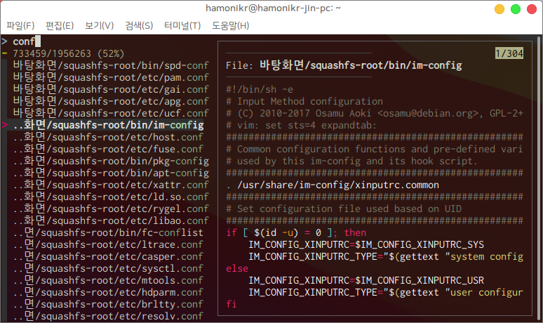

## hamonikr-ff

- 터미널에 사용자를 위한 파일의 내용을 보고 편집하는 프로그램
- 키보드의 방향키로 파일을 탐색하고 편집 가능
- 향상된 파일 검색 기능 제공

## 프로그램 실행
터미널에서 ```ff``` 명령 실행
```
$ ff

또는

$ ff <디렉토리>
```

## 설치

이 프로그램은 하모니카 4.0 패키지 저장소에서 공급됩니다.

```
sudo apt install hamonikr-ff
```

## 사용법
1) 프로그램 > 터미널 (Ctrl+Alt+T)
2) ff
3) 원하는 검색어 입력

## 이슈 또는 버그
 사용 중 문제를 발견하시면 root@hamonikr.org 또는 https://hamonikr.org 에서 알려주세요.
